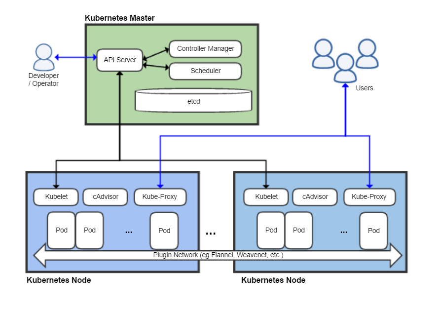

# Kubernetes Workshop

Stefan Siegl (@stesie23, <rolf@mayflower.de>)

<!--s-->

# Who am I?

* Stefan Siegl, living in Würzburg
* Software Developer
* mostly Spring Boot & React
* interested in functional programming & DevOps
* working for Mayflower GmbH, Würzburg
* used to live in Ansbach

<!--s-->

# Agenda

* Start Minikube
* Essential Kube Concepts
* Pod, Service, Helm, Ingress
* Replica Set & Deployments

For the moment let's keep it stateless :-)

<!--v-->

## Stuff Ignored Today

* Resource Limits
* Cronjobs
* Stateful Sets
* Persistent Volumes & PV Claims
* Scheduling over multiple Nodes

<!--s-->

# Minikube

* Install *minikube* and *kubectl*, see https://kubernetes.io/docs/tasks/tools/install-minikube/

```
$ minikube start --memory 8192
... keep waiting ...
$ kubectl config current-context
minikube
```

<!--v-->

after installation the pod list should look like this:

```
$ kubectl -n kube-system get pods
NAME                                   READY     STATUS    RESTARTS   AGE
coredns-86c58d9df4-thf4x               1/1       Running   0          36s
coredns-86c58d9df4-vnfsl               1/1       Running   0          36s
kube-proxy-tqrmc                       1/1       Running   0          36s
kubernetes-dashboard-ccc79bfc9-q5866   1/1       Running   0          33s
storage-provisioner                    1/1       Running   0          33s
```

<!--v-->

# Follow along

https://github.com/stesie/kube-workshop/

<!--s-->

# Essentials

Kubernetes is a Container Orchestrator

* Docker = single container
* docker-compose = multiple containers
* Kubernetes = multiple containers on multiple machines

... forget about Docker Swarm :)

Ignore Kubernetes on Rkt ...

<!--v-->

## Architecture


Source: https://de.wikipedia.org/wiki/Kubernetes#/media/File:Kubernetes.png; CC-BY-SA 4.0

<!--v-->

Plugin concept, to support multiple software defined networks (and different cloud providers).

It allows to integrate with cloud provider's load balancers and authentication mechanisms (like AWS IAM & ELB/ALB/NLB)

<!--v-->

## Concepts

* everything is a resource
* resource types: pods, replica set, deployment, service, ingress ...
* ... even custom resource definitions (CRDs), out of scope for today
* declared as yaml
* controllers constantly compare declared state with actual state -> apply changes as needed

<!--v-->

## names, labels & annotations

* every resource has a unique name (unique within resource type & namespace)
* labels are arbitrary key/value pairs
* other resources are selected by querying for labels
* annotations are further key/value attributes on resources, mostly for third-party stuff

<!--v-->

## Pods

* smallest managed part in Kubernetes
* pods are immutable!
* set of containers (usually one, use only for containers that can't do without others)
* init containers (may be multiple ones, run one after another)
* share network space, i.e. *localhost*

<!--s-->

# Demo

